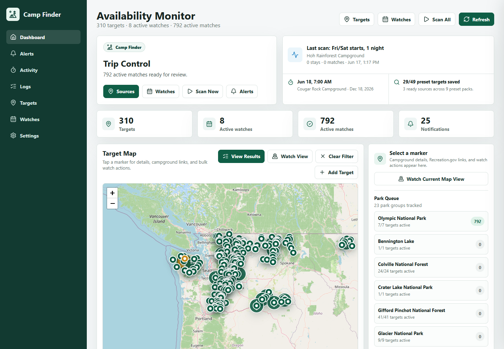
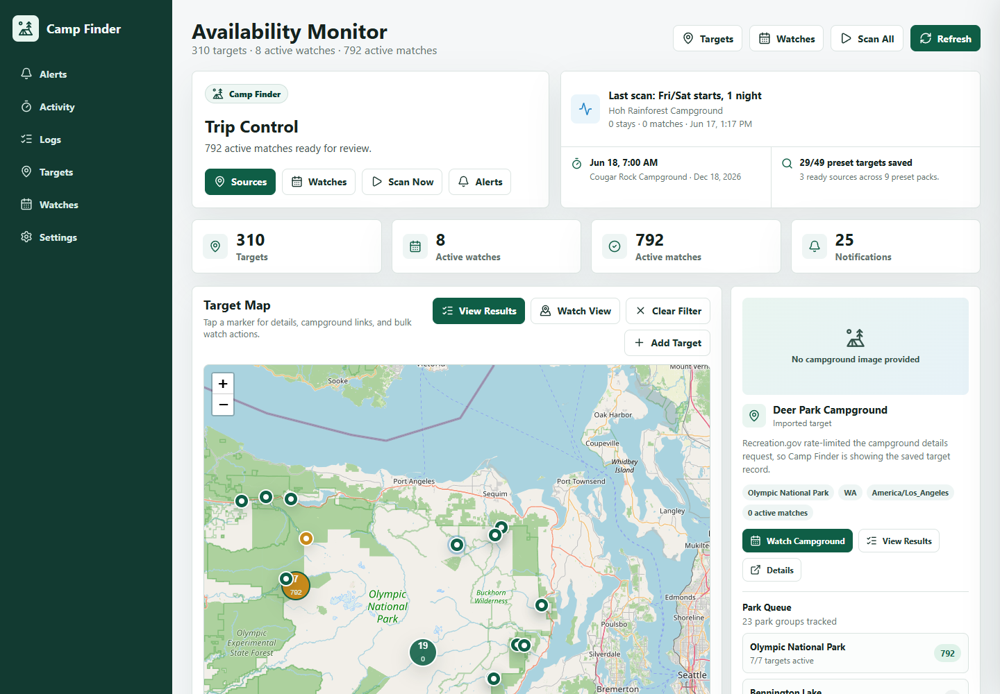
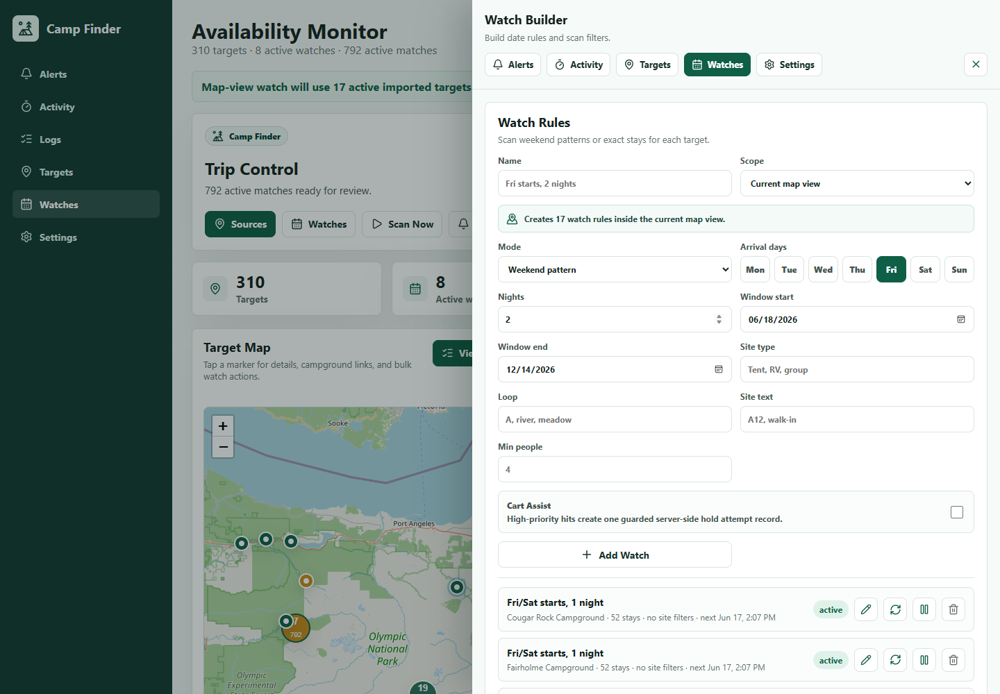
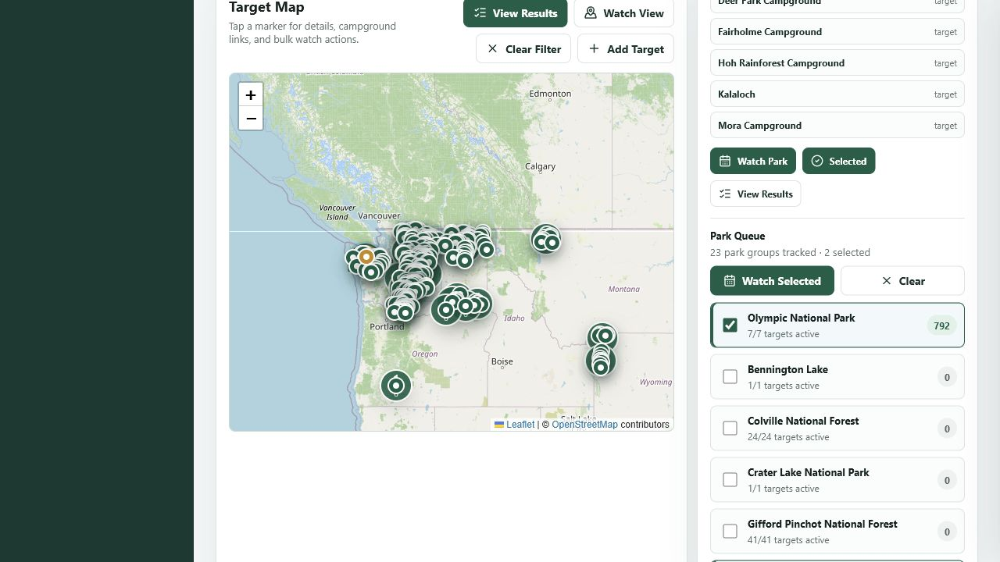

# Camp Finder

Camp Finder is a local-network web app for monitoring Recreation.gov campground availability. It is designed to run in Docker, persist its data in SQLite, and notify you when a configured campground/date rule has availability.

The app is still notification-first. It opens Recreation.gov booking links when a match appears, and it can flag selected watches as high priority for Cart Assist logging. The current Cart Assist implementation is a guarded audit trail and readiness check; it does not automatically click Add to Cart, submit payment, or try to get around Recreation.gov login or CAPTCHA checks.

## Screenshots

Dashboard overview:



Campground map details:



Region watch setup:



Park region selection:



## What It Does

- Add campground targets from Recreation.gov search.
- Import preset target packs for Pacific Northwest, Northern Rockies, Greater Yellowstone, or California national parks, then trim targets you do not want.
- Check preset packs against live Recreation.gov campground search and optionally import the discovered source list.
- Edit target display names, park/state labels, booking links, and day/week/month release-window settings.
- Detect a likely release window from Recreation.gov campsite reservation-window data when available.
- Pause and resume targets or individual watch rules without deleting them.
- Create watch rules with one or more arrival weekdays and a stay length, such as Friday or Saturday starts for two nights.
- Create the same watch across one campground, a park group, selected park groups, a state, or the active imported targets currently visible on the map.
- Create exact arrival/departure date watches.
- Edit watch names, targets, dates, day patterns, stay length, and site filters after creation.
- Filter watch matches by campsite type, loop text, site text, and minimum people capacity.
- Poll availability on a configurable interval, with a default minimum of 10 minutes.
- Reuse fresh Recreation.gov month responses across watches and back off automatically after HTTP 429 rate limits.
- Temporarily increase scan cadence around calculated release times.
- Run every active watch on demand with the Scan All control.
- See the latest scan state at the top of the dashboard, including manual scans and background scans that are still running.
- Open the Activity drawer for scan run history, recent checkpoint events, and a manual Stop Scan control.
- Open the Logs page for a deeper diagnostic view of scan events, durable runs, and notification delivery.
- Revalidate previously available matches on each successful scan and remove matches that Recreation.gov no longer returns.
- Review recent scan activity, including candidate counts, matches, status, and messages.
- Calculate likely release windows from a target-specific booking window, release time, and timezone.
- Store availability matches once so notifications are deduped.
- Send one bulk notification per scan when multiple new site/date matches appear.
- Mark selected watches as high priority with Cart Assist, then record one guarded assist attempt when a new match appears.
- Show Cart Assist server readiness and recent attempt history without exposing Recreation.gov credentials in the browser.
- Configure server-level Cart Assist from the dashboard or from Docker environment variables.
- Triage availability results as opened, booked, dismissed, or active again.
- Filter, sort, select, and bulk-update availability results from the dashboard.
- Inspect map markers with Recreation.gov descriptions, details links, Google Maps navigation links, activity tags, notices, and images when Recreation.gov provides media.
- Use park bounding boxes and Park Queue checkboxes to select campground groups directly from the map.
- Show notification channel status, configure delivery settings, and send a test notification.
- Notify by webhook, Home Assistant webhook, ntfy mobile push, and/or SMTP email when configured.
- Export and restore targets, watches, scan controls, notification settings, and Cart Assist settings.
- Run as a single Docker Compose service on your local network.

## Dashboard Workflow

The dashboard is organized around the work that usually matters first:

1. Trip Control shows the current priority state, scan status, next release hint, and source coverage before the map and results.
2. The sidebar opens slide-out drawers for Alerts, Activity, Targets, Watches, and Settings. These tools stay available without stretching the main dashboard.
3. Scan state and summary counts show whether Camp Finder is idle, scanning, or showing the last completed scan.
4. The map uses Leaflet with OpenStreetMap tiles to show saved targets plus preset park/campground options. Selecting a marker or park region opens a detail panel with the campground overview, result counts, Recreation.gov details link, and watch actions. View Results jumps straight from the map to the working list, Watch View creates a rule across active imported targets inside the current map bounds, and Park Queue checkboxes can build a watch from selected park groups.
5. Availability Results stay in the main working area so new matches are not buried below target and watch configuration.
6. The Alerts drawer gives quick access to active matches, recent notification delivery, View Results, and Clear All.
7. The Activity drawer shows the active scanner state, recent scan runs, recent checkpoint events, a Logs link, refresh, and Stop Scan.
8. Target and watch setup live in the same slide-out drawer system. Use the Targets and Watches buttons in the header or sidebar to open them. The Targets drawer starts with campground search, then the source catalog, then static preset fallbacks.
9. Result filters let you switch between active, all, available, opened, booked, and dismissed results.
10. Result search matches park name, campground, site, loop, campsite type, watch name, and stay dates.
11. Sort controls support newest first, arrival date, and park/campground grouping.
12. Select Visible lets you bulk dismiss, mark booked, or reopen the results currently in view.

In normal use, you add or import targets, create watch rules, then spend most of your time in the map, scan status, and results sections. Alerts, Activity, Targets, Watches, and Settings are slide-out drawers so the working area stays shorter. Release hints remain in a full-width planner below Availability Results, and the Logs link opens a dedicated diagnostics page when you need more detail than the Activity drawer shows.

## Preset Packs

The app currently ships with static park packs that were built from Recreation.gov campground search:

- PNW and Northern Rockies National Parks: Olympic, Mount Rainier, Crater Lake, North Cascades, and Glacier Recreation.gov campground facilities.
- Individual park packs: Olympic, Mount Rainier, Crater Lake, North Cascades, Glacier, Yellowstone, and Grand Teton.
- California National Parks: Yosemite, Sequoia/Kings Canyon, and Joshua Tree starter campgrounds.

Preset targets use campground IDs verified through Recreation.gov search results and include facilities whose Recreation.gov parent is the named park. Some parks also have concession-run or non-reservable campgrounds outside Recreation.gov, so those cannot be scanned by this Recreation.gov-backed app yet. The release settings still remain editable at the target level in the database model, because Recreation.gov booking windows can vary by facility.

The target drawer has three ways to use each preset:

- Import bundled list: imports the static fallback list that ships with the app.
- Check source: queries Recreation.gov search for each park in the pack and compares the live campground IDs against the bundled list.
- Import source list: imports the campgrounds returned by the live source check.

The source check is intentionally visible instead of automatic. It pages through Recreation.gov campground search for each park, keeps only exact parent-park matches, and verifies bundled campground IDs that the broad search misses. It shows how many campgrounds Recreation.gov returned, how many are new compared with the bundled list, and how many bundled targets were not returned by the current source search. That keeps the app useful when the network or upstream API is unavailable while still letting the campground lists drift with Recreation.gov over time.

Paused targets are skipped by background scans and Scan All. Paused watch rules are kept in the dashboard but are also skipped until resumed.

## Source Catalog

The Targets drawer also includes a source catalog. This is the v2 path for dynamic campground discovery. Source entries are grouped by what they represent rather than by a hand-maintained import list:

- National parks: live Recreation.gov discovery for the requested Olympic, Rainier, Crater Lake, North Cascades, Glacier, Yellowstone, and Grand Teton set.
- National forests: live Recreation.gov discovery for Washington national forests such as Olympic, Mount Baker-Snoqualmie, Okanogan-Wenatchee, Gifford Pinchot, and Colville.
- Regions: a Washington Recreation.gov state starter for federal campgrounds that are not covered by a named park or forest source yet.
- Washington state: official Washington State Parks and WA DNR entries. These are research/directory sources for now, with official links, not availability scanners.

Ready sources have Check and Import actions. Check runs the live Recreation.gov search and reports how many campgrounds came back and how many are not imported yet. Import creates or updates campground targets from that live source response. Research and directory sources only link to the official source because the app does not yet have a safe availability connector for those systems.

## Map and Region Watches

The map is both a navigation tool and a watch builder. Click a park marker or its bounding box to see a park summary, quick campground list, result counts, and a Watch Park button. Click a campground marker to load its Recreation.gov campground details, including description text, activities, amenities, active notices, a Recreation.gov details link, a Google Maps directions link, and a campground image when Recreation.gov returns one. Some Recreation.gov campground records do not include media, so the UI shows a simple placeholder instead of guessing with stock imagery. If Recreation.gov does not return a detail record or rate-limits that lookup, Camp Finder falls back to the saved target record instead of blocking the map panel.

Park regions are calculated from the visible campground coordinates in each park group. The Park Queue checkbox highlights that group's map box and adds it to the selected group set. Use Watch Selected to open the watch form with the Selected park groups scope; Camp Finder then creates one ordinary watch rule per active imported target in those groups.

Bulk watch scopes create ordinary watch rules behind the scenes. If you choose a park, selected park groups, state, or current map view, Camp Finder creates one watch per active imported target in that scope, using the same date pattern and filters from the watch form. Preset-only markers can be inspected from the map, but they need to be imported as targets before a recurring watch can scan them.

Use the current map view scope for practical regions that do not line up with park or state names. Pan and zoom the Washington-centered map until the campgrounds you care about are visible, click Watch View, confirm the dates and filters, then save. A freehand polygon selector is not implemented yet, but the map-bounds scope covers the common "everything in this area for Friday and Saturday" workflow without adding another drawing mode.

## Source Roadmap

Camp Finder should keep treating Recreation.gov as the first-class source for federal campground targets. Recreation.gov publishes RIDB/API data for federal recreation areas, facilities, campsites, tours, and permits, and its own "Use Our Data" page encourages apps to consume those records and credit Recreation.gov. The current source-check buttons are the first version of that idea: they query Recreation.gov live, compare the response with bundled fallback targets, and can import the discovered campground list.

For v2, the target source model is moving from hand-maintained park packs to saved source definitions. A source definition says what it covers, how it is grouped, and how it refreshes. The first groupings are:

- National parks by parent park name.
- National forests and other federal lands by managing agency, recreation area, state, and region.
- Custom Recreation.gov searches for a state, region, or keyword.
- Washington state sources as their own provider family, not mixed into federal national-park packs.

Washington needs a staged approach. Washington State Parks publishes reservation guidance, a reservable-park list, and sends reservations through `washington.goingtocamp.com`; no public availability API is documented in the app yet. The first Washington State Parks phase should therefore be a source directory with official reservation links and park metadata, followed by an availability connector only after the reservation system can be reviewed safely. Washington DNR is different: DNR publishes campground GIS data through the Washington geospatial open-data portals, which can seed maps and target directories, but those records do not by themselves mean a site is reservable or scannable.

## Watch Filters

Watch filters are optional. If left blank, Camp Finder reports every campsite that is available for the requested stay. If set, all populated filters must match:

- Site type: case-insensitive contains match against Recreation.gov campsite type.
- Loop: case-insensitive contains match against loop name.
- Site text: case-insensitive contains match against site label.
- Minimum people: excludes known sites with lower max occupancy.

## Cart Assist Boundaries

Recreation.gov says booking windows are set by individual facilities and lists booking-window details under each facility's Seasons & Booking tab. It also describes active bot mitigation and notes that Add to Cart holds a campsite for a limited checkout window. For that reason, Camp Finder keeps Cart Assist conservative:

- Cart Assist is off by default at the server and off by default on every watch rule.
- A watch must opt in before a new match can create a Cart Assist attempt.
- The server records at most one configured attempt per scan by default.
- A cooldown prevents repeated attempts from piling up.
- Credentials, if used, belong in the server `.env` file or in the dashboard-managed appdata settings, not in browser local storage.
- Attempt records can be marked opened, booked, dismissed, failed, or ready again from the dashboard.
- This build records readiness and manual-checkout attempts. It does not run an automated browser worker yet, does not submit payment, and does not bypass login, CAPTCHA, or any ambiguous Recreation.gov screen.

The next safe step is a separate browser worker that can use one persistent Recreation.gov session, stop on any challenge or uncertainty, and hand the final checkout decision back to you. That worker should be explicitly enabled only after reviewing current Recreation.gov terms and the behavior of your account.

## Implementation Guide

Camp Finder is meant to run as one Docker service on a trusted local network or private VPN. The container serves the React frontend, FastAPI backend, background scanner, SQLite database, and static assets from the same port.

Use [compose.yaml](/compose.yaml) on a remote server when you want to pull the published image from GitHub Container Registry. Use [docker-compose.yml](/docker-compose.yml) when you are developing locally and want Docker to build from this checkout.

### Server Install

Every push to `main` publishes `ghcr.io/skestral/lynx-camp:main`. On the server, put the compose file and appdata folder in the directory where you want Camp Finder to live:

```bash
mkdir -p appdata/config
curl -fsSLO https://raw.githubusercontent.com/skestral/lynx-camp/main/compose.yaml
curl -fsSLo appdata/config/.env.example https://raw.githubusercontent.com/skestral/lynx-camp/main/appdata/config/.env.example
cp appdata/config/.env.example appdata/config/.env
nano appdata/config/.env
docker compose pull
docker compose up -d
```

Open `http://<server-ip>:8080` from a device on the same network. Do not expose the web UI directly to the public internet; the app does not include login protection yet.

If GitHub Container Registry requires authentication on the server, run:

```bash
echo "<github-token>" | docker login ghcr.io -u skestral --password-stdin
```

### Local Source Build

For local development or testing changes from this checkout:

```powershell
docker compose -f docker-compose.yml up -d --build
```

Then open `http://localhost:8080`. Local source builds use the named Docker volume `campfinder-data` for the SQLite database. The server compose file uses `./appdata`, which is easier to back up and move between machines.

### First-Run Setup

1. Open the Targets drawer and import a preset pack or run a live source import.
2. Open the map, inspect target coverage, and import any preset-only campgrounds you want to scan.
3. Open the Watches drawer and create a watch for one campground, a park group, selected park groups, a state, or the current map view.
4. Open Settings and confirm scan cadence, request delay, rate-limit backoff, and notification channels.
5. Send a test notification before relying on unattended scans.
6. Use Download in Settings to save a backup once targets, watches, and settings look right.

### Runtime Data

Keep `appdata/config/.env` on the server only. It is where file-managed notification secrets, SMTP credentials, ntfy tokens, and optional Recreation.gov credentials belong. Dashboard-saved settings are stored in SQLite at `appdata/campfinder.db` and override `.env` defaults.

Protect `appdata` the same way you would protect a `.env` file. This app does not encrypt dashboard-saved Recreation.gov credentials at rest yet; the current tradeoff is simple remote-server setup over secret-manager complexity. For now, those values make the server status read as ready and allow guarded attempt records for high-priority watches; they are not used to complete checkout.

If you prefer file-managed Cart Assist defaults, set these in `appdata/config/.env`:

```text
CAMPFINDER_CART_ASSIST_ENABLED=true
CAMPFINDER_CART_ASSIST_COOLDOWN_MINUTES=30
CAMPFINDER_CART_ASSIST_MAX_ATTEMPTS_PER_SCAN=1
CAMPFINDER_RECREATION_GOV_USERNAME=you@example.com
CAMPFINDER_RECREATION_GOV_PASSWORD=your-password-or-app-secret
```

You can also configure Cart Assist from the dashboard. The dashboard only shows whether credentials are configured. It never prints the username or password. UI config exports omit saved secrets by default; use Include saved secrets only when you intentionally need a portable backup that contains credentials or webhook secrets.

### Development

Backend:

```powershell
python -m pip install -r backend/requirements.txt
python -m uvicorn backend.app.main:app --host 0.0.0.0 --port 8080
```

Frontend:

```powershell
cd frontend
npm install
npm run dev
```

Open `http://localhost:5173` for Vite development, or build the frontend and use the backend on `http://localhost:8080`.

## Configuration Backups

The Settings drawer can download and restore a JSON config backup. A backup includes targets, watches, target release settings, watch Cart Assist flags, scan control overrides, notification settings, and server-level Cart Assist settings. Availability results, scan logs, notification delivery history, and Cart Assist attempt history are not included.

Saved secrets are redacted from downloaded backups unless Include saved secrets is checked before export. Redacted values stay on the server that created the backup, and importing a redacted backup does not erase existing saved secrets on the destination server. When Include saved secrets is checked, the JSON file contains stored Recreation.gov credentials, webhook URLs, ntfy topic/token values, and SMTP username/password values. Treat that file like a `.env` file.

## Scanning

Camp Finder scans active watches in the background and respects the minimum poll interval from the server scan controls. The `.env` values are the startup defaults, and the dashboard Settings panel can save appdata overrides for scan cadence, release scanning, request delay, caching, and rate-limit backoff. Saved dashboard values are stored in `appdata/campfinder.db` and take effect for new scans immediately. Use Reset to Env in Settings when you want the server to fall back to the `.env` values again.

The UI also has a Scan All button for a manual sweep across every active watch. Manual scans are useful when you import a preset pack, add filters, or want to check the current Recreation.gov response immediately.

Release-aware scanning is enabled by default. Targets can use release windows in days, weeks, or months. If a watched stay has a calculated release time coming up, Camp Finder wakes up before that release and temporarily uses `CAMPFINDER_RELEASE_SCAN_INTERVAL_MINUTES` during the window configured by `CAMPFINDER_RELEASE_SCAN_BEFORE_MINUTES` and `CAMPFINDER_RELEASE_SCAN_AFTER_MINUTES`. Defaults are 15 minutes before, 60 minutes after, and a 10-minute release-window interval. Lower intervals should be an explicit choice after considering Recreation.gov's bot mitigation and shared API impact.

Camp Finder also has guardrails for off-season scans and rate limits. These can be changed from Settings without rebuilding the container:

- `CAMPFINDER_AVAILABILITY_CACHE_MINUTES` defaults to `5`. Fresh monthly availability responses are reused across watches for the same campground/month, which keeps multiple weekend rules from making duplicate API calls.
- `CAMPFINDER_API_REQUEST_DELAY_SECONDS` defaults to `1`. The scanner waits between uncached Recreation.gov month requests.
- `CAMPFINDER_RATE_LIMIT_BACKOFF_MINUTES` defaults to `60`. If Recreation.gov returns HTTP 429, the scanner records the scan as `rate_limited`, schedules the affected watches after the backoff, and skips additional API calls while the backoff is active.

The Target Settings form includes a Detect Window action. It samples Recreation.gov campsite reservation-window metadata for the selected campground and applies the most common window it finds, such as a 14-day rolling window when a facility exposes that rule.

For campgrounds with staggered releases, use View Profiles in Target Settings. It groups sampled Recreation.gov campsite metadata by loop, site type, and reservation window, which helps you decide whether a watch should filter to a specific loop and use a different day/week/month release window.

The scan status strip at the top of the dashboard changes as soon as a manual scan starts. While a scan is active, the dashboard refreshes scan runs, scan events, results, and Cart Assist attempts every few seconds so long Recreation.gov checks show which watch is currently running. It also uses recent scan-run records, so background scans that are still marked `running` can surface after the periodic dashboard refresh.

The Activity drawer is the first place to look when a scan appears stuck. It shows the current scanner state, recent durable scan rows, recent checkpoint events, refresh, a Logs link, and Stop Scan. The Logs page is the deeper diagnostic view. It shows the loaded checkpoint event stream beside recent scan runs and notification delivery, including events such as scan start, candidate count, Recreation.gov month fetches, available-site discoveries, rate limits, errors, and cancellation requests. If the server restarts while a scan row is still marked `running`, startup marks that row `interrupted` so the dashboard does not keep showing a stale process forever.

Stop Scan asks the server to cancel the active scan at the next safe checkpoint and also marks any stale `running` rows as cancelled. It does not delete results or watch rules. A Recreation.gov request that is already in flight may take until its HTTP timeout before the scanner can stop, but the activity log records the stop request immediately.

## Booking Assist

Availability results include the Recreation.gov booking link plus status actions. Campsite links include the arrival date as `startDate`, so opening a result or Cart Assist checkout task goes straight to a booking page for the watched stay. The dashboard also adds that date before copying booking details, which keeps older saved rows useful after upgrades. Open marks a fresh match as opened, Copy puts a booking brief on your clipboard with the campground, watch, site, loop, type, stay dates, and Recreation.gov link. If the browser blocks clipboard access, the same brief appears above the results for manual selection. Booked records that you successfully reserved it, Dismiss removes it from active attention, and Reopen moves a handled result back to active availability. Future scans preserve booked and dismissed decisions for the same campsite/date result instead of notifying you about the same handled match again.

Each successful scan also revalidates active results for the same watch and date ranges. If a previously active site/date match is not returned again, Camp Finder marks it booked and removes it from the active list. Scan errors and Recreation.gov rate limits do not clear old results, because those runs did not prove the match disappeared.

Results are grouped by national park, campground, and stay dates. Campground and stay sections start collapsed so the list is easier to scan after large result bursts. The dashboard loads up to 2,000 recent result rows so large scans can still be searched, grouped, selected, and handled in bulk. It also shows server-side total and active counts, and warns if the loaded working set is clipped. Use the status filter and search field to narrow the dashboard before selecting results. Bulk actions apply to selected results only; Clear All dismisses every active availability result, which is useful when a scan finds many sites that you do not want to pursue.

For high-priority trips, enable Cart Assist on the watch rule. When a new match appears, the scanner writes a Cart Assist attempt with one of these statuses:

- `off`: the watch is not using Cart Assist.
- `disabled`: the watch asked for Cart Assist, but the server feature flag is off.
- `needs credentials`: the server flag is on, but Recreation.gov credentials are not configured.
- `manual required`: the server is ready and the match should be handled in Recreation.gov manually.
- `opened`: the booking link was opened from the dashboard and still needs a final decision.
- `booked`: you successfully reserved the site.
- `dismissed`: you reviewed the hit and decided not to pursue it.
- `failed`: checkout could not continue or the page did not match expectations.
- `cooldown`: a recent attempt already happened and the cooldown is still active.
- `skipped`: the per-scan attempt cap has already been reached.

These records are shown on the matching availability result card and in the Settings drawer. They are intentionally boring and explicit, because a hold workflow needs a trustworthy log more than it needs surprises.

The Remote hold guard row in the dashboard shows the server's current Cart Assist state before a scan creates anything. `ready` means the server flag and credentials are set and no active checkout task is inside the cooldown window. `needs credentials` means the watch can ask for Cart Assist, but the remote server still needs Recreation.gov credentials. `cooling down` means a manual-checkout task is already active inside the cooldown window, and the row shows roughly when the next attempt can be prepared. `off` means the server-level guard is disabled.

The Checkout queue row is the fastest way to see whether Cart Assist needs attention. Active manual-checkout tasks are counted there and shown ahead of older attempt history, so a remote server can sit quietly until something actually needs a decision. If a ready task exists, Open Next opens its dated Recreation.gov booking link and marks the Cart Assist record as opened.

Use Open on the matching result card or on a ready Cart Assist record to open the Recreation.gov booking page and mark the attempt as opened. After you decide what happened, mark it Booked, Dismissed, or Failed. Booked and dismissed attempts also update the matching availability result, and resolved attempts no longer count against the cooldown. If an attempt was created before credentials were configured, use Ready after the server settings are fixed to make it an active manual-checkout task without creating a duplicate record.

## Map Provider

The dashboard map uses Leaflet with OpenStreetMap's public raster tile endpoint by default. The map keeps OpenStreetMap attribution visible. For heavier use, private deployments, or stricter tile-policy control, point the frontend at a different compatible tile service before building:

```text
VITE_CAMPFINDER_TILE_URL=https://tile.openstreetmap.org/{z}/{x}/{y}.png
VITE_CAMPFINDER_TILE_ATTRIBUTION=&copy; <a href="https://www.openstreetmap.org/copyright">OpenStreetMap</a> contributors
```

If you use the default OpenStreetMap tile service, keep the attribution visible and avoid prefetching or bulk tile downloads.

When a scan discovers several new site/date matches at once, Camp Finder sends one bulk alert instead of one notification per campsite. `CAMPFINDER_MAX_NOTIFICATION_RESULTS` controls how many examples appear in that notification and defaults to `5`; the rest remain visible in the results dashboard. If the watch uses Cart Assist, the alert includes the Cart Assist attempt note and a link back to the dashboard queue so you know the remote server has a high-priority task waiting.

## Notification Setup

Notification settings can be managed from the Settings drawer. Values saved in the dashboard are stored in `appdata/campfinder.db` and override the `.env` defaults for new notifications. Secret fields such as webhook URLs, ntfy topics and tokens, SMTP username/password, and Cart Assist credentials are write-only in the form: the dashboard shows whether they are configured but does not print the saved value back into the browser.

If you prefer file-managed defaults, set the same values in `appdata/config/.env` or in your local `.env`.

For a Discord-compatible or generic webhook, configure Webhooks in Settings or set:

```text
CAMPFINDER_WEBHOOK_URL=https://...
```

Discord webhooks work because Camp Finder sends a simple `content` payload.

For Home Assistant, paste a webhook URL from a webhook-triggered automation into Settings or set:

```text
CAMPFINDER_HOME_ASSISTANT_WEBHOOK_URL=https://homeassistant.example.com/api/webhook/...
```

The Home Assistant channel receives structured JSON with `source`, `event`, `message`, `app_url`, match counts, and a bounded `matches` list. That lets an automation use the simple text message or route on fields such as campground, arrival date, and booking URL.

For ntfy phone push, subscribe to a private topic in the ntfy mobile app and set:

```text
CAMPFINDER_NTFY_SERVER=https://ntfy.sh
CAMPFINDER_NTFY_TOPIC=your-hard-to-guess-topic
CAMPFINDER_NTFY_PRIORITY=high
```

If your ntfy server requires a token, also set:

```text
CAMPFINDER_NTFY_TOKEN=...
```

For SMTP, set:

```text
CAMPFINDER_SMTP_HOST=smtp.example.com
CAMPFINDER_SMTP_PORT=587
CAMPFINDER_SMTP_USERNAME=you@example.com
CAMPFINDER_SMTP_PASSWORD=app-password
CAMPFINDER_SMTP_FROM=you@example.com
CAMPFINDER_SMTP_TO=you@example.com
```

`CAMPFINDER_MAX_NOTIFICATION_RESULTS` can also be changed in Settings. It controls how many match examples appear in one alert when a scan finds several new sites at once.

The Settings drawer shows which notification channels are configured and which values are missing. Use the test button after changing `.env` or saving dashboard values to confirm delivery before relying on background scans.

## Notes From OpenCamp

This project uses the same Recreation.gov availability pattern that makes OpenCamp useful: campground search plus monthly campground availability calls. Camp Finder wraps that idea in a persistent local web app with watch rules, release-window hints, dedupe, and Docker hosting.

## Next Useful Phases

1. Add filters for equipment, max vehicle length, accessible sites, and electric/water hookups when the API exposes them consistently.
2. Persist source definitions and last source-check results in SQLite instead of keeping the catalog code-defined.
3. Add custom source creation for a Recreation.gov parent area, state, region, or keyword.
4. Add a Washington State Parks directory importer once park metadata and reservation links can be normalized safely.
5. Add notification channels such as Pushover, Telegram, or richer email templates.
6. Add the guarded browser worker for Cart Assist, using one persistent Recreation.gov session and stopping on login challenges, CAPTCHA, unexpected pages, or any payment step.
